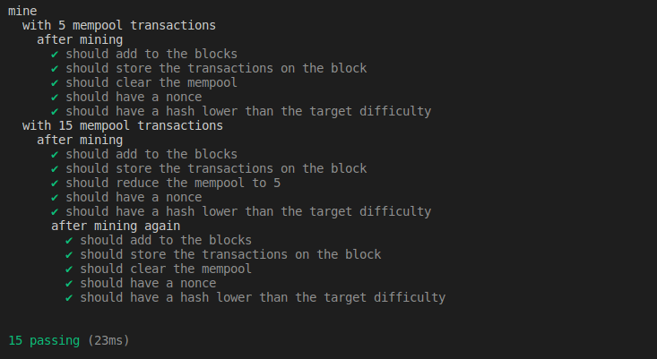

# Proof of work

This challenge is part of [Alchemy University](https://university.alchemy.com)'s Ethereum Developer Bootcamp.

## Goal

Build basic proof of work miner.

## Available Scripts

- Type `npm install` to install required packages
- Type `npm run test` to run tests

## Test Results

